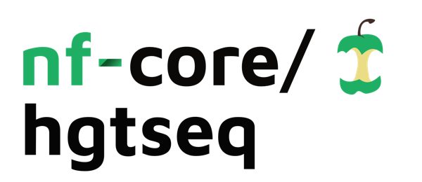
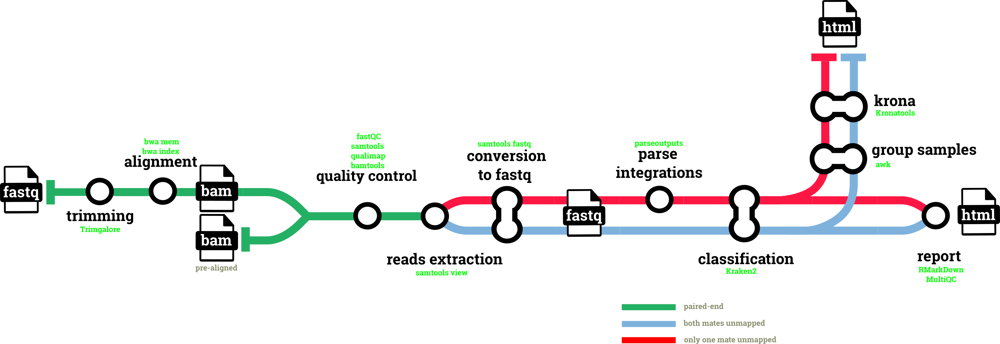

<h1>
  <picture>
    <source media="(prefers-color-scheme: dark)" srcset="docs/images/nf-core-hgtseq_logo_dark.png">
    
  </picture>
</h1>

[](https://github.com/codespaces/new/nf-core/hgtseq)
[](https://github.com/nf-core/hgtseq/actions/workflows/nf-test.yml)
[](https://github.com/nf-core/hgtseq/actions/workflows/linting.yml)[](https://nf-co.re/hgtseq/results)[](https://doi.org/10.5281/zenodo.7244734)
[](https://www.nf-test.com)

[](https://www.nextflow.io/)
[](https://github.com/nf-core/tools/releases/tag/4.1.0)
[](https://docs.conda.io/en/latest/)
[](https://www.docker.com/)
[](https://sylabs.io/docs/)
[](https://cloud.seqera.io/launch?pipeline=https://github.com/nf-core/hgtseq)

[](https://nfcore.slack.com/channels/hgtseq)[](https://bsky.app/profile/nf-co.re)[](https://mstdn.science/@nf_core)[](https://www.youtube.com/c/nf-core)

## Introduction

**nf-core/hgtseq** is a bioinformatics best-practice analysis pipeline built to investigate horizontal gene transfer from NGS data.

The pipeline uses metagenomic classification of paired-read alignments against a reference genome to identify the presence of non-host microbial sequences within read pairs, and to infer potential integration sites into the host genome.

On release, automated continuous integration tests run the pipeline on a full-sized dataset on the AWS cloud infrastructure. This ensures that the pipeline runs on AWS, has sensible resource allocation defaults set to run on real-world datasets, and permits the persistent storage of results to benchmark between pipeline releases and other analysis sources. The results obtained from the full-sized test can be viewed on the [nf-core website](https://nf-co.re/hgtseq/results).

<p align="center">

</p>

## Pipeline summary

The pipeline accepts paired-end FastQ files or already aligned BAM files, which can be mixed in the same samplesheet.

1. FastQ input only:
   1. Raw reads QC ([`FastQC`](https://www.bioinformatics.babraham.ac.uk/projects/fastqc/))
   2. Adapter and quality trimming ([`Trim Galore!`](https://www.bioinformatics.babraham.ac.uk/projects/trim_galore/))
   3. Trimmed reads QC ([`FastQC`](https://www.bioinformatics.babraham.ac.uk/projects/fastqc/))
   4. Alignment to the host genome ([`BWA-MEM`](https://github.com/lh3/bwa) or [`BWA-MEM2`](https://github.com/bwa-mem2/bwa-mem2))
2. Sorting and indexing of the alignments ([`SAMtools`](https://www.htslib.org))
3. Alignment QC ([`SAMtools`](https://www.htslib.org), [`Qualimap`](http://qualimap.conesalab.org), [`BamTools`](https://github.com/pezmaster31/bamtools))
4. Extraction of the unmapped reads by SAM flag, in two categories: reads unmapped with a mapped mate, and read pairs with both mates unmapped ([`SAMtools`](https://www.htslib.org))
5. Parsing of the candidate integration sites from the position of the mapped mates ([`SAMtools`](https://www.htslib.org))
6. Taxonomic classification of the unmapped reads ([`Kraken2`](https://github.com/DerrickWood/kraken2))
7. Interactive plots of the classified reads ([`Krona`](https://github.com/marbl/Krona))
8. HTML analysis report ([`RMarkdown`](https://rmarkdown.rstudio.com), [`ggbio`](https://bioconductor.org/packages/ggbio/))
9. QC summary report ([`MultiQC`](http://multiqc.info/))

## Usage

> [!NOTE]
> If you are new to Nextflow and nf-core, please refer to [this page](https://nf-co.re/docs/get_started/environment_setup/overview) on how to set-up Nextflow. Make sure to [test your setup](https://nf-co.re/docs/get_started/run-your-first-pipeline) with `-profile test` before running the workflow on actual data.

First, prepare a samplesheet with your input data. Each row is either a sample with a pair of FastQ files:

```csv title="samplesheet.csv"
sample,fastq_1,fastq_2
SAMPLE1,sample1_R1.fastq.gz,sample1_R2.fastq.gz
```

or a sample with an aligned BAM file:

```csv title="samplesheet.csv"
sample,bam
SAMPLE2,sample2.bam
```

Now, you can run the pipeline using:

```bash
nextflow run nf-core/hgtseq \
   -profile <docker/singularity/.../institute> \
   --input samplesheet.csv \
   --outdir <OUTDIR> \
   --genome GRCh38 \
   --taxonomy_id 9606 \
   --krakendb /path/to/kraken2_db \
   --kronadb /path/to/krona/taxonomy.tab
```

> [!WARNING]
> Please provide pipeline parameters via the CLI or Nextflow `-params-file` option. Custom config files including those provided by the `-c` Nextflow option can be used to provide any configuration _**except for parameters**_; see [docs](https://nf-co.re/docs/running/run-pipelines#using-parameter-files).

For more details and further functionality, please refer to the [usage documentation](https://nf-co.re/hgtseq/usage) and the [parameter documentation](https://nf-co.re/hgtseq/parameters).

## Pipeline output

To see the results of an example test run with a full size dataset refer to the [results](https://nf-co.re/hgtseq/results) tab on the nf-core website pipeline page.
For more details about the output files and reports, please refer to the
[output documentation](https://nf-co.re/hgtseq/output).

## Credits

nf-core/hgtseq was originally written by Simone Carpanzano, Francesco Lescai.

We thank nf-core community, and in particular the authors of the modules used in the pipeline: Paolo Cozzi, Jose Espinosa-Carrasco, Phil Ewels, Gisela Gabernet, Maxime Garcia, Jeremy Guntoro, Friederike Hanssen, Matthias Hortenhuber, Patrick Hüther, Suzanne Jin, Felix Krueger, Harshil Patel, Alex Peltzer, Abhinav Sharma, Gregor Sturm, James Fellows Yates.

## Contributions and Support

If you would like to contribute to this pipeline, please see the [contributing guidelines](docs/CONTRIBUTING.md).

For further information or help, don't hesitate to get in touch on the [Slack `#hgtseq` channel](https://nfcore.slack.com/channels/hgtseq) (you can join with [this invite](https://nf-co.re/join/slack)).

## Citations

If you use nf-core/hgtseq for your analysis, please cite the article describing the pipeline:

> Carpanzano S, Santorsola M, nf-core community, Lescai F. hgtseq: A Standard Pipeline to Study Horizontal Gene Transfer. _Int J Mol Sci._ 2022 Nov 22;23(23):14512. doi: [10.3390/ijms232314512](https://doi.org/10.3390/ijms232314512).

and the Zenodo doi of the version you used: [10.5281/zenodo.7244734](https://doi.org/10.5281/zenodo.7244734)

An extensive list of references for the tools used by the pipeline can be found in the [`CITATIONS.md`](CITATIONS.md) file.

You can cite the `nf-core` publication as follows:

> **The nf-core framework for community-curated bioinformatics pipelines.**
>
> Philip Ewels, Alexander Peltzer, Sven Fillinger, Harshil Patel, Johannes Alneberg, Andreas Wilm, Maxime Ulysse Garcia, Paolo Di Tommaso & Sven Nahnsen.
>
> _Nat Biotechnol._ 2020 Feb 13. doi: [10.1038/s41587-020-0439-x](https://dx.doi.org/10.1038/s41587-020-0439-x).
