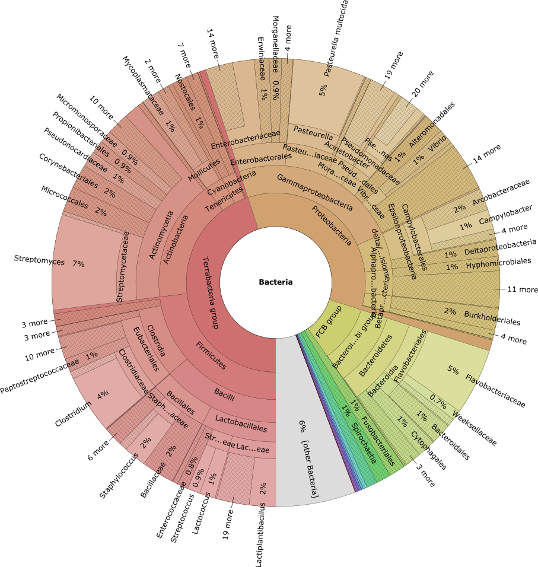
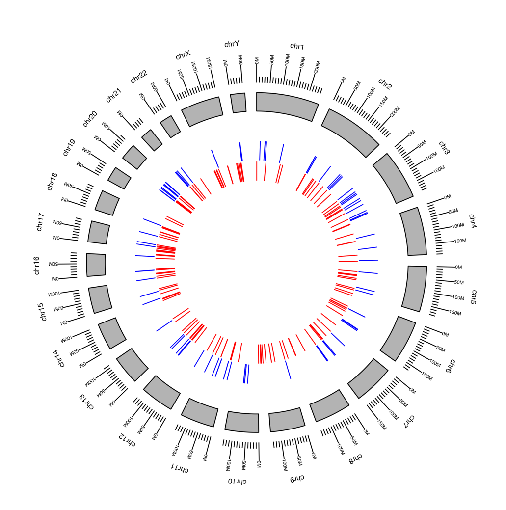

# nf-core/hgtseq: Output

## Introduction

This document describes the output produced by the pipeline. Most of the plots are taken from the MultiQC report, which summarises results at the end of the pipeline.

The directories listed below will be created in the results directory after the pipeline has finished. All paths are relative to the top-level results directory.

## Pipeline overview

The pipeline is built using [Nextflow](https://www.nextflow.io/) and processes data using the following steps:

- [Preprocess](#preprocess)
  - [Trimming](#trimming) - Adapter and quality trimming of the FastQ files with Trim Galore!
  - [Alignment](#alignment) - Alignment of the FastQ files to the host genome with BWA-MEM or BWA-MEM2, then sorting and indexing with SAMtools
  - [Extracted reads](#extracted-reads) - Extraction of the unmapped reads by SAM flag with SAMtools
  - [Converted reads](#converted-reads) - Conversion of the extracted reads to FastQ, and parsing of the candidate integration sites with SAMtools
- [Results](#results)
  - [Classified reads](#classified-reads) - Taxonomic classification with Kraken2, and collation of the classified reads of all samples
  - [Krona plots](#krona-plots) - Interactive multi-layered pie charts with Krona
  - [Analysis report](#analysis-report) - HTML report with RMarkdown
- [Quality control](#quality-control)
  - [FastQC](#fastqc) - Raw and trimmed reads QC
  - [Qualimap](#qualimap) - Alignment QC
  - [BamTools](#bamtools) - Alignment statistics
- [MultiQC](#multiqc) - Aggregate report describing results and QC from the whole pipeline
- [Pipeline information](#pipeline-information) - Report metrics generated during the workflow execution

Samples provided as BAM files skip the trimming, the alignment and the FastQC steps.

## Preprocess

### Trimming

Output files

- `preprocess/trimming/`
  - `<sample>_{1,2}_val_{1,2}.fq.gz`: FastQ files after adapter and quality trimming.
  - `<sample>_{1,2}.fastq.gz_trimming_report.{txt,json}`: Reports of the trimming, with the run statistics.

[Trim Galore!](https://www.bioinformatics.babraham.ac.uk/projects/trim_galore/) removes the adapter contamination and trims the low quality regions of the reads. The pipeline runs it with the `--illumina` option.

### Alignment

Output files

- `preprocess/alignment/`
  - `<sample>.bam`: Alignments of the trimmed reads to the host genome, only for samples provided as FastQ files.
  - `<sample>_sorted.bam`: Alignments sorted by coordinate.
  - `<sample>_sorted.bam.bai`: Index of the sorted alignments.

[BWA-MEM](https://github.com/lh3/bwa) (default) or [BWA-MEM2](https://github.com/bwa-mem2/bwa-mem2) (`--aligner bwa-mem2`) align the trimmed reads to the host reference genome. The alignments, together with the BAM files provided as input, are then sorted and indexed with [SAMtools](https://www.htslib.org).

### Extracted reads

Output files

- `preprocess/extracted_reads/`
  - `single_unmapped/<sample>.bam`: Paired reads that are unmapped, but whose mate is mapped (SAM flag 5, excluding flags 8 and 256).
  - `both_unmapped/<sample>.bam`: Paired reads that are unmapped, and whose mate is also unmapped (SAM flag 13, excluding flag 256).

[SAMtools](https://www.htslib.org) extracts from the sorted alignments the two categories of unmapped reads, using their SAM bitwise flags. Non-primary alignments (flag 256) are excluded in both cases.

### Converted reads

Output files

- `preprocess/converted_reads/`
  - `single_unmapped/<sample>.fastq.gz`: Reads unmapped with a mapped mate, converted to FastQ for the classification with Kraken2.
  - `both_unmapped/<sample>.fastq.gz`: Read pairs with both mates unmapped, converted to FastQ for the classification with Kraken2.
  - `parsed_integration_sites/<sample>_parsed_integration_sites.txt`: For each read unmapped with a mapped mate, the read name, and the chromosome and position of its mapped mate, i.e. the candidate integration site in the host genome.

## Results

### Classified reads

Output files

- `results/classified/`
  - `single_unmapped/`
    - `<sample>.kraken2.classifiedreads.txt`: Kraken2 classification of each read unmapped with a mapped mate.
    - `<sample>.kraken2.report.txt`: Kraken2 report of the classification.
  - `both_unmapped/`
    - `<sample>.kraken2.classifiedreads.txt`: Kraken2 classification of each read pair with both mates unmapped.
    - `<sample>.kraken2.report.txt`: Kraken2 report of the classification.
  - `collate_kraken/`
    - `single_unmapped/kraken_classified_reads_collated.txt`: Reads unmapped with a mapped mate classified to a taxon, for all the samples.
    - `both_unmapped/kraken_classified_reads_collated.txt`: Read pairs with both mates unmapped classified to a taxon, for all the samples.

[Kraken2](https://github.com/DerrickWood/kraken2) is a taxonomic classification system using exact k-mer matches to achieve high accuracy and fast classification speeds. This classifier matches each k-mer within a query sequence to the lowest common ancestor (LCA) of all genomes containing the given k-mer. The k-mer assignments inform the classification algorithm.

The classified reads of all the samples are then collated with [GNU Awk](https://www.gnu.org/software/gawk/), keeping only the reads assigned to a taxon other than the root of the taxonomy, to generate a single Krona plot per category.

### Krona plots

Output files

- `results/kronaplots/`
  - `single_unmapped/group.html`: Interactive pie chart of the reads unmapped with a mapped mate.
  - `both_unmapped/group.html`: Interactive pie chart of the read pairs with both mates unmapped.

[Krona](https://github.com/marbl/Krona) allows hierarchical data to be explored with zooming, multi-layered pie charts. The resulting interactive charts are self-contained and can be viewed with any modern web browser.

### Analysis report

Output files

- `results/analysis_report/`
  - `analysis_report.html`: HTML analysis report.
  - `analysis_report.RData`: R workspace with the data used to generate the report, for further analyses.

[RMarkdown](https://rmarkdown.rstudio.com) provides an authoring framework for data science, and its documents are fully reproducible. The analysis report:

- assigns a score to each taxon, based on the k-mers analysed by Kraken2;
- for human data (`--taxonomy_id 9606`), displays a circular plot made with the [GenomicRanges](https://bioconductor.org/packages/GenomicRanges/) and [ggbio](https://bioconductor.org/packages/ggbio/) R packages, which shows the position on the chromosomes of the candidate integration sites.

## Quality control

### FastQC

Output files

- `QC/`
  - `fastqc_raw/`
    - `*_fastqc.html`: FastQC report of the raw reads, containing quality metrics.
    - `*_fastqc.zip`: Zip archive containing the FastQC report, tab-delimited data file and plot images.
  - `fastqc_trimmed/`
    - `*_fastqc.html`: FastQC report of the trimmed reads, containing quality metrics.
    - `*_fastqc.zip`: Zip archive containing the FastQC report, tab-delimited data file and plot images.

[FastQC](http://www.bioinformatics.babraham.ac.uk/projects/fastqc/) gives general quality metrics about your sequenced reads. It provides information about the quality score distribution across your reads, per base sequence content (%A/T/G/C), adapter contamination and overrepresented sequences. For further reading and documentation see the [FastQC help pages](http://www.bioinformatics.babraham.ac.uk/projects/fastqc/Help/).

### Qualimap

Output files

- `QC/qualimap/<sample>/`
  - `qualimapReport.html`: Qualimap BamQC report.
  - `genome_results.txt`: Summary of the BamQC results.
  - `css/`, `images_qualimapReport/`, `raw_data_qualimapReport/`: Style sheets, plots and data of the report.

[Qualimap](http://qualimap.conesalab.org) examines sequencing alignment data in SAM/BAM files according to the features of the mapped reads and provides an overall view of the data that helps to detect biases in the sequencing and/or mapping of the data and eases decision-making for further analysis. When an annotation is available (`--genome` or `--gff`), the analysis is restricted to the annotated regions.

### BamTools

Output files

- `QC/bamtools/stats/`
  - `<sample>.bam.stats`: General alignment statistics.

[BamTools](https://github.com/pezmaster31/bamtools) is a toolkit for handling BAM files. The `bamtools stats` command prints general alignment statistics from the BAM file.

The alignment statistics generated with `samtools stats`, `samtools flagstat` and `samtools idxstats` are not published, but are included in the MultiQC report.

## MultiQC

Output files

- `multiqc/`
  - `multiqc_report.html`: a standalone HTML file that can be viewed in your web browser.
  - `multiqc_data/`: directory containing parsed statistics from the different tools used in the pipeline.
  - `multiqc_plots/`: directory containing static images from the report in various formats.

[MultiQC](http://multiqc.info) is a visualization tool that generates a single HTML report summarising all samples in your project. Most of the pipeline QC results are visualised in the report and further statistics are available in the report data directory.

Results generated by MultiQC collate pipeline QC from supported tools e.g. FastQC, SAMtools, Qualimap and Kraken2. The pipeline has special steps which also allow the software versions to be reported in the MultiQC output for future traceability. For more information about how to use MultiQC reports, see <http://multiqc.info>.

## Pipeline information

Output files

- `pipeline_info/`
  - Reports generated by Nextflow: `execution_report.html`, `execution_timeline.html`, `execution_trace.txt` and `pipeline_dag.html`.
  - Reports generated by the pipeline: `pipeline_report.html`, `pipeline_report.txt` and `nf_core_hgtseq_software_mqc_versions.yml`. The `pipeline_report*` files will only be present if the `--email` / `--email_on_fail` parameters are used when running the pipeline.
  - Parameters used by the pipeline run: `params.json`.

[Nextflow](https://docs.seqera.io/platform-cloud/reports/overview) provides excellent functionality for generating various reports relevant to the running and execution of the pipeline. This will allow you to troubleshoot errors with the running of the pipeline, and also provide you with other information such as launch commands, run times and resource usage.
